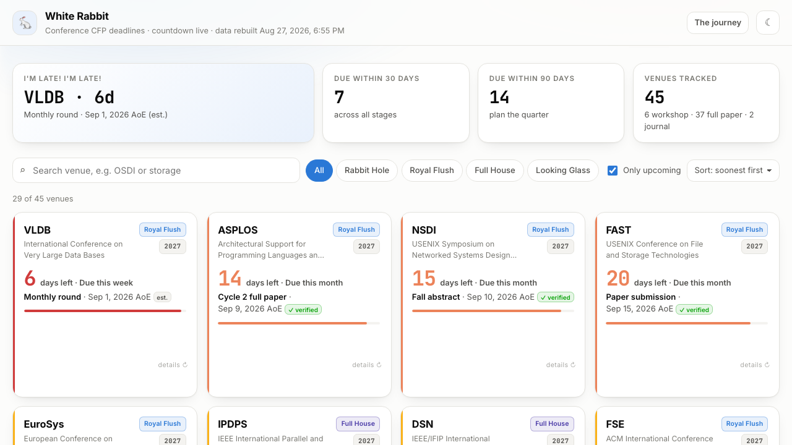

<h1 align="center">White Rabbit 🐇</h1>

<p align="center">
  <em>"Oh dear! Oh dear! I shall be too late!"</em><br>
  A self-updating tracker for conference paper deadlines.
</p>

<p align="center">
  <a href="https://kritshekhar.github.io/WhiteRabbit/"><b>Live dashboard</b></a> ·
  <a href="CONTRIBUTING.md">Contributing</a>
</p>

<p align="center">
  <a href="https://github.com/Kritshekhar/WhiteRabbit/actions/workflows/update-deadlines.yml"></a>
  <a href="https://github.com/Kritshekhar/WhiteRabbit/actions/workflows/validate.yml"></a>
</p>



---

A static site with no backend. GitHub Actions rebuilds the data every night and
publishes to GitHub Pages; the countdowns themselves are computed in your browser,
so the numbers are right even between builds.

Four pages:

| | |
|---|---|
| **CFP** | 99 conference and workshop deadlines |
| **PhD Fellowships** | 13 fellowships open to PhD students |
| **Grants** | 55 grant and research-award calls for faculty and PIs |
| **The journey** | what the stage names mean |

Three things make it different from a spreadsheet of dates:

- **Every date says whether it was checked.** A ✓ **verified** badge links to the
  CFP page it was read off. An **est.** badge means extrapolated from previous
  cycles and not yet confirmed. There is no third state.
- **Links roll over on their own.** Once a cycle closes, the venue moves to next
  year's site as soon as that site is genuinely live.
- **It tracks a project's path, not a league table.** Workshop → full paper →
  journal, with grades only where they matter. See **[the journey](https://kritshekhar.github.io/WhiteRabbit/journey.html)**.
- **Every deadline is one click from your calendar.** The Google Calendar link
  is built as an absolute UTC instant rather than an all-day event, because an
  all-day event lands on the viewer's local day and would silently move an AoE
  deadline by one.

## Adding a venue

Edit **`conferences.yml`** - it is the only file you need to touch. The one
required field is `name`; everything else has a sensible default.

```yaml
  - name: HotOS
    full_name: Workshop on Hot Topics in Operating Systems
    tier: rabbit-hole                              # stage on the journey
    url: https://sigops.org/s/conferences/hotos/2027/
    url_template: https://sigops.org/s/conferences/hotos/{year}/
    year: 2027
    cycle_years: 2                                 # biennial
    deadlines:
      - name: Paper submission
        date: 2027-01-14T23:59:00-12:00            # -12:00 is AoE
        confirmed: true
        source: https://sigops.org/s/conferences/hotos/2027/cfp.html
        verified_on: 2026-08-27
```

Open a PR and CI validates it. Full guide in **[CONTRIBUTING.md](CONTRIBUTING.md)**.

<details>
<summary><b>Field reference</b></summary>

| Field | Meaning |
|---|---|
| `name` | **required** - the label on the card |
| `full_name` | spelled-out name, shown underneath |
| `tier` | `rabbit-hole` \| `royal-flush` \| `full-house` \| `looking-glass` - stage on [the journey](https://kritshekhar.github.io/WhiteRabbit/journey.html) (default `full-house`) |
| `url` | homepage for the current cycle |
| `url_template` | pattern for auto-rollover: `{year}`→2027, `{yy}`→27, `{yyn}`→28. Omit to freeze the link. |
| `year` | which edition `url` points at |
| `month` | month the conference is held (sorting hint) |
| `cycle_years` | years between editions (default 1; `2` for biennial venues) |
| `rolling` | `true` for journals - shows "Rolling submission", never counts down |
| `formats` | what it accepts, e.g. `[Full paper, Poster]` - shown as **Accepts** tags |
| `tracks` | e.g. `[Research, Industry]` - shown as **Tracks** tags |
| `notes` | free text shown on the card |
| `deadlines[]` | `{ name, date, confirmed, track, source, verified_on }` |
| ↳ `date` | ISO 8601. Use `-12:00` for AoE; any other offset works and the dashboard shows the zone. `null` renders as **TBA**. |
| ↳ `confirmed` | `true` only if you read it on the CFP page - **requires `source`** |
| ↳ `track` | optional, for venues whose tracks close on different days |

</details>

## How it works

```
conferences.yml  ──►  scripts/update.py         ──►  data/deadlines.json  ──►  index.html
grants.yml       ──►  scripts/update_grants.py  ──►  data/grants.json     ──►  fellowships.html
  you edit these       nightly + on push             build output              grants.html
```

Two config files, one per kind of deadline. `grants.yml` holds both fellowships
and grants in one list, split onto two pages by an `eligibility:` field, so a
programme moves between audiences by editing one word.

The list pages are rows; clicking one opens `venue.html?id=…`, a single detail
page that reads the same JSON and renders whichever record the query names.
That keeps every venue deep-linkable without generating a file per venue.

`data/deadlines.json` holds ISO dates and **no day counts** - `assets/app.js`
recomputes days, urgency colours and sort order from `Date.now()` on every page
load. That is why a venue can go un-probed for weeks and its countdown is still
correct this morning.

Fetching is therefore only about link health and year rollover, so a nightly run
re-checks only what plausibly moved: venues with unverified dates, venues whose
last check failed, venues with a rollover pending, and anything last checked over
30 days ago. Everything else carries its previous result forward. Verifying a date
also makes the build cheaper, since a confirmed venue drops out of the nightly set.

### Year rollover

When every deadline in a cycle has passed, the updater renders `url_template` for
the next year and moves only if that page answers 2xx/3xx **and** looks real  - 
mentions the new year, exceeds 1 KB, and is not a bare directory listing. After
probing, a venue that rolled onto a link that is not `ok` is put back.

Those checks are not paranoia. `sigops.org/…/sosp/2099/` returns the SOSP 2017
page, `conferences.sigcomm.org/hotnets/2027/` is an empty autoindex whose title
contains "2027", and one host answered `200` to GitHub's runners and `404` to us
minutes later. Each one produced a wrong rollover before the check existed.

On success the script bumps `year`, rewrites `url`, shifts the deadlines forward
and sets `confirmed: false` - a shifted date is an estimate until a human checks it.

## Tools

```bash
python scripts/validate_config.py            # structural checks; runs on every PR
python scripts/validate_grants.py            # the same, for grants.yml
python scripts/import_ccf.py AI --dry-run    # pull venues from ccf-deadlines
python scripts/import_grants.py --dry-run    # pull CS grants from grants.gov
python scripts/verify_grants.py --dry-run    # confirm federal dates at source
python scripts/check_deadlines.py eurosys    # what the venue's own page says
python scripts/check_deadlines.py --formats  # page limits and track names
python scripts/update.py --scope all         # rebuild, re-probing everything
```

`check_deadlines.py` prints the config's claim next to every deadline-looking line
on the venue's site:

```
### EuroSys  (2027)
    source: https://2027.eurosys.org/cfp
    config: Fall round: 2026-10-16T23:59:00-12:00  <- unconfirmed
    site:   Paper titles and abstracts due: Thursday, September 17, 2026
    site:   Full paper submissions due: Thursday, September 24, 2026
```

It **never writes to the config**, and that is deliberate. CFP pages are prose,
and plenty of them serve last year's dates from this year's URL - NDSS's 2027 page
still shows 2024 dates. Auto-parsing that would quietly produce wrong deadlines,
which is the one thing a deadline tracker must not do. The tool proposes; a person
decides.

Add `--firecrawl` for pages plain fetching cannot read (JS-rendered, bot-blocked,
prose-buried). It works without an API key; `FIRECRAWL_API_KEY` raises the rate
limit and unlocks CFP-page discovery. It runs last, only after the free paths fail.

## Local development

```bash
git clone https://github.com/Kritshekhar/WhiteRabbit.git && cd WhiteRabbit
python3 -m venv .venv && .venv/bin/pip install -r requirements.txt
.venv/bin/python scripts/update.py --no-network   # rebuild without HTTP
python3 -m http.server 8000                       # open localhost:8000
```

`index.html` needs a server - opening the file directly will not load the data.

## Workflows

| Workflow | Trigger | Does |
|---|---|---|
| `validate.yml` | every PR | validates `conferences.yml`, proves an offline build works |
| `update-deadlines.yml` | nightly 07:00 UTC · monthly full sweep · push | rebuilds both datasets, rolls venues over, commits back |
| `deploy-pages.yml` | push to `main` | publishes to GitHub Pages |
| `propose-deadlines.yml` | Mondays 08:00 UTC | sweeps CFP pages for `est.` venues, opens an issue - never edits the config |

Deploy is a separate workflow on purpose: publishing can be blocked by Pages
settings, and that should not make a healthy data refresh look like a broken build.

## Running your own

Fork it, replace `conferences.yml` with the venues for your field, then enable
**Settings → Pages → Source: GitHub Actions** and
**Settings → Actions → Workflow permissions: Read and write** (the nightly job
commits the rebuilt data back).

## Where the data comes from

| Source | What | How |
|---|---|---|
| hand-maintained | the original venue list, all 13 fellowships | `conferences.yml`, `grants.yml` |
| [ccf-deadlines](https://github.com/ccfddl/ccf-deadlines) (MIT) | 54 AI/ML venues | `import_ccf.py`, every link probed first |
| [grants.gov](https://www.grants.gov/) API | 50 federal CS grants | `import_grants.py`, filtered by CFDA code |
| grants.gov `fetchOpportunity` | 33 verified grant deadlines | `verify_grants.py`, sourced to the agency solicitation |

Two sources were assessed and rejected: `paperswithcode/ai-deadlines`, which
has not been updated since September 2024 and has no future deadlines, and
NSF's own funding pages, which return 202 to scripts and whose RSS feed is dead.

## A note on the dates

Every date here is community-maintained and some are extrapolated. The **est.**
badge is honest, not decorative - **always confirm on the venue's own CFP page
before you plan around it.** If you spot a wrong date,
[open an issue](https://github.com/Kritshekhar/WhiteRabbit/issues/new/choose);
it takes one line to fix.

## License

MIT - see [LICENSE](LICENSE).
