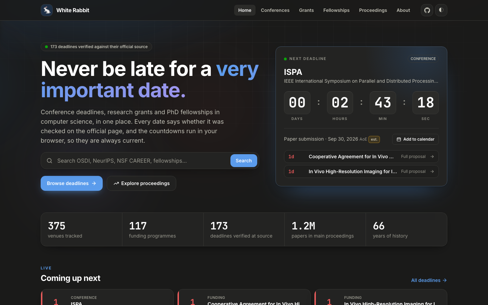

<p align="center"></p>

<h1 align="center">White Rabbit</h1>

<p align="center">
  Deadlines for computer science conferences, grants and fellowships, checked against
  official sources, with statistics from decades of past proceedings.
</p>

<p align="center">
  <a href="https://kritshekhar.github.io/WhiteRabbit/"><b>Open the site</b></a> ·
  <a href="CONTRIBUTING.md">Contributing</a>
</p>

<p align="center">
  <a href="https://github.com/Kritshekhar/WhiteRabbit/actions/workflows/update-deadlines.yml"></a>
  <a href="https://github.com/Kritshekhar/WhiteRabbit/actions/workflows/validate.yml"></a>
  <a href="https://github.com/Kritshekhar/WhiteRabbit/actions/workflows/deploy-pages.yml"></a>
</p>



---

## What it is

A static site, rebuilt every night, that answers two questions researchers ask
all year: *when is the next deadline I care about*, and *what does that venue
actually publish*.

| Page | What you get |
|---|---|
| **Home** | the next deadline with a live countdown, what is due soon across conferences and funding, and a search across everything |
| **Conferences** | 375 venues across AI, systems, security, databases, networking, software engineering, HCI, graphics and theory, with ticking countdowns |
| **Grants** | federal and industry calls for faculty and PIs, filterable by funder and ACM classification |
| **Fellowships** | PhD fellowships, with when each cycle usually opens |
| **Proceedings** | papers per year over each venue's full history, its distinctive keywords and topics, rising and fading research phrases, where an idea spreads across venues, similar venues, author trends, and a link to every year's proceedings |
| **About** | the stages a project moves through: workshop, full paper, journal |

Every conference page also summarises that venue's past proceedings: papers per
year, growth, keywords, team size, how many papers come from entirely new
teams, similar venues, and links to read the latest proceedings.

## Why trust the dates

- **Every date says whether it was checked.** A **✓ verified** badge links to the
  official page the date was read from. An **est.** badge means extrapolated or
  imported and not yet confirmed. The database refuses a verified date without
  a source.
- **Verification is automatic but strict.** Each night, `verify_deadlines.py`
  opens every venue's own site, follows its *Call for Papers* and *Important
  Dates* links, and marks a deadline verified only when that page, for this
  edition, states exactly our date on a line about the same deadline and not
  another track. If the page says something different, nothing is changed:
  the date goes to a review queue for a person to confirm.
- **Verified is final.** A verified row is never crawled again; only unverified
  rows are revisited.
- **Links roll over on their own.** When a cycle closes, the venue moves to next
  year's site once that site is genuinely live. The old cycle is kept as
  history, and the new dates stay estimates until they are verified.
- **Calendar entries do not drift.** The Google Calendar link is an exact UTC
  instant, not an all-day event, so an AoE deadline never moves by a day.

Countdowns are computed in your browser from the stored dates, so they are
correct to the second even between builds.

## How it works

```
data/whiterabbit.sql ──► scripts/db.py build ──► db/whiterabbit.sqlite ──► web/ (Astro) ──► GitHub Pages
  private data repo         (gitignored)               ▲
                                                     │
   update.py · verify_deadlines.py · import_*.py · verify_grants.py · proceedings_*.py · wr.py
```

- **Data.** A SQLite database (`db/schema.sql`). The data itself is kept in a
  separate private repository and checked out at `data/`: a deterministic text
  dump with one row per line, `data/whiterabbit.sql`, so every change is an
  ordinary diff. The `.sqlite` file is a build artefact, rebuilt automatically
  when the dump or schema changes. This repository holds the code and the site.
- **Site.** [Astro](https://astro.build) with React islands and Tailwind, in
  `web/`. Every venue, grant and proceedings page is pre-rendered from the
  database at build time; filters, charts and countdowns run in the browser.
- **Pipeline.** Python scripts in `scripts/`, run by GitHub Actions. Apart from
  the venue importer, they use only the standard library.

### Proceedings statistics

`proceedings_dblp.py` downloads the [DBLP](https://dblp.org) XML dump (about
1 GB, refreshed monthly, kept in the Actions cache and never in git), streams
it once, and computes for each venue and year: papers in its main proceedings
volume, distinctive title phrases, authors per paper, papers by entirely new
teams, most published authors, and links to the volume on the publisher's
site and on DBLP. Across venues it finds rising and fading phrases, where each
idea spreads, and which venues publish on similar things.

This covers 344 venues and over a million papers back to 1960. Counts are
**papers in the main DBLP volume**, not official acceptance counts: some venues
publish short papers in the same volume, and workshop volumes and front matter
are excluded. A finished year's count is verified with its DBLP table of
contents as the source and never recomputed.

`proceedings_openalex.py` adds research topics per venue and year from
[OpenAlex](https://openalex.org). Without an API key OpenAlex allows 1,000
requests a day, so this backfills a little every day and resumes where it
stopped.

## Editing the data

`scripts/wr.py` is the editor. Every command writes through to the dump, so a
change shows up in `git diff`.

```bash
python scripts/wr.py show osdi                                    # one venue or grant
python scripts/wr.py queue                                        # what still needs verifying
python scripts/wr.py add-venue HotOS --full-name "Workshop on Hot Topics in Operating Systems" \
    --tier rabbit-hole --url https://sigops.org/s/conferences/hotos/2027/ \
    --url-template "https://sigops.org/s/conferences/hotos/{year}/" --year 2027 --topic Systems
python scripts/wr.py set hotos cycle_years 2                      # biennial
python scripts/wr.py add-deadline hotos "Paper submission" 2027-01-14T23:59:00-12:00
python scripts/wr.py verify hotos --source https://sigops.org/s/conferences/hotos/2027/cfp.html
```

`verify` is the only manual way a row becomes verified, and it needs
`--source`, the official page you read the date on. Dates are ISO 8601; use
`-12:00` for AoE, and a bare date means AoE end of day. An edit that breaks a
rule is refused and nothing is saved. The full guide is in
**[CONTRIBUTING.md](CONTRIBUTING.md)**.

<details>
<summary><b>Venue fields</b></summary>

| Field | Meaning |
|---|---|
| `name` | **required**, the label on the row |
| `full_name` | spelled-out name, shown underneath |
| `tier` | `rabbit-hole` (workshop) \| `royal-flush` \| `full-house` (full paper) \| `looking-glass` (journal); default `full-house` |
| `url` | homepage for the current cycle |
| `url_template` | pattern for rollover: `{year}`→2027, `{yy}`→27, `{yyn}`→28. Empty freezes the link. |
| `year` | which edition `url` points at |
| `month` | month the conference is held (sorting hint) |
| `cycle_years` | years between editions (default 1; `2` for biennial venues) |
| `rolling` | `1` for journals: shows "Rolling submission" and never counts down |
| `formats`, `tracks`, `topics` | comma-separated with `wr.py set`, e.g. `"Full paper, Poster"` |
| `notes` | free text shown on the venue page |
| `dblp_key` | the venue's DBLP stream, e.g. `conf/fast`, for proceedings statistics |

</details>

## Tools

```bash
python scripts/db.py check                     # validate the data; runs on every PR
python scripts/verify_deadlines.py --dry-run   # check unverified dates against official pages
python scripts/verify_deadlines.py --write --render --jina   # ...and apply (Chrome + Jina fallbacks)
python scripts/check_deadlines.py eurosys      # print what a venue's own page says
python scripts/check_deadlines.py --formats    # page limits and track names
python scripts/update.py --scope all           # probe links, roll venues over
python scripts/import_ccf.py AI SE --dry-run   # import more venues
python scripts/import_grants.py --dry-run      # import new federal CS grants
python scripts/verify_grants.py --dry-run      # confirm federal grant dates at source
python scripts/proceedings_dblp.py             # proceedings counts, keywords, authors
python scripts/proceedings_openalex.py         # topic backfill
```

`verify_deadlines.py` needs no accounts or API keys. It reads pages directly,
renders JavaScript-only sites in headless Chrome (`--render`), and as a last
resort reads them through the free Jina Reader (`--jina`). Firecrawl is
supported with `--firecrawl` if you have a key.

## Local development

```bash
git clone https://github.com/Kritshekhar/WhiteRabbit.git && cd WhiteRabbit
git clone git@github.com:Kritshekhar/WhiteRabbit-data.git data   # the data (private, needs access)
python3 scripts/db.py build                    # db/whiterabbit.sqlite from the dump
cd web && npm install && npm run dev           # http://localhost:4321/WhiteRabbit/
```

Only the venue importer needs a package (`pip install -r requirements.txt`).

## Workflows

In this repository:

| Workflow | When | What it does |
|---|---|---|
| `validate.yml` | every PR | `db.py check`, requires a canonical dump, proves an offline build works |
| `deploy-pages.yml` | push to `main`, and twice a day | builds the database and the Astro site, publishes to GitHub Pages |

The jobs that change the data run in the private data repository, so their
logs, issues and review pull requests stay private: the nightly deadline
refresh (verification on official pages, link probes, rollovers), the daily
proceedings statistics, the weekly funding sweep and the weekly CFP sweep.
They check out this repository's code and commit to the data repository; the
site picks the changes up at its next scheduled build.

## Running your own

Fork it, create a private data repository with your own dump at
`whiterabbit.sql` (start from `wr.py add-venue`), give this repository a read
deploy key to it as the `DATA_DEPLOY_KEY` secret, change the repository names
in the workflows, and enable **Settings → Pages → Source: GitHub Actions**.

## Data sources

| Source | Used for |
|---|---|
| Venue and funder websites | deadlines, verified on the official page |
| [DBLP](https://dblp.org) XML dump (CC0) | papers per year, title keywords, authors, links to proceedings |
| [OpenAlex](https://openalex.org) (CC0) | research topics per venue and year |

## A note on the dates

Dates marked **est.** have not yet been confirmed on the official page.
**Always check the venue's own call for papers before you plan around a date.**
If you spot a wrong one, [open an issue](https://github.com/Kritshekhar/WhiteRabbit/issues/new/choose);
it takes one line to fix.

## License

MIT, see [LICENSE](LICENSE).
